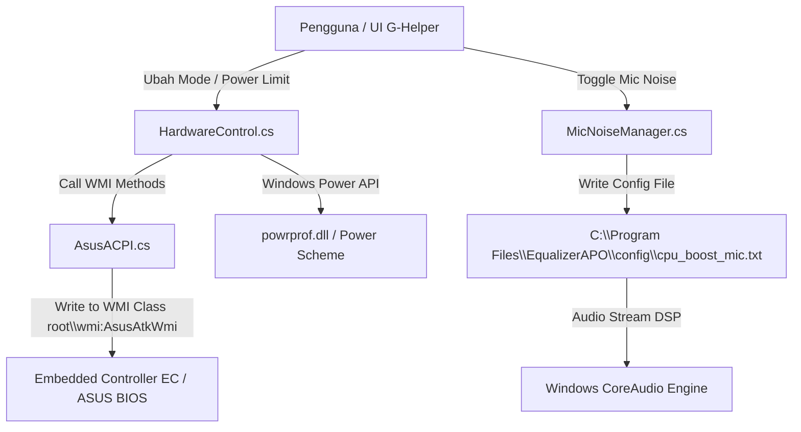

# Documentation & Context: G-Helper Mod (for AI Agents & Developers)

Dokumen ini menyediakan gambaran teknis lengkap, arsitektur sistem, struktur direktori, serta fitur-fitur modifikasi pada repositori `g-helper-mod`. Dokumen ini dirancang khusus sebagai konteks utama bagi **AI Coding Assistants** (seperti Antigravity, Gemini, Claude, ChatGPT) maupun pengembang perangkat lunak.

---

## 1. Ikhtisar & Tujuan Aplikasi (Overview & Purpose)

**G-Helper Mod** adalah aplikasi kontrol pihak ketiga (*third-party control utility*) berbasis Windows C# (.NET) yang ringan untuk laptop ASUS (ROG, TUF, ZenBook, Vivobook, ProArt) serta perangkat genggam (ROG Ally). 

Aplikasi ini berfungsi sebagai pengganti penuh untuk bloatware berat bawaan produsen seperti **ASUS Armoury Crate** dan **MyASUS**.

### Fitur Utama:
- **Pengaturan Power Mode & Thermal**: Perpindahan cepat antara *Silent*, *Balanced*, dan *Turbo* dengan *fan curves* dan *Power Limits* (PL1/PL2/PPT) kustom.
- **Pengaturan GPU Mode**: Kontrol MUX Switch / NVIDIA Optimus (*Eco*, *Standard/Optimized*, *Ultimate*).
- **Pengaturan Layar & Baterai**: Pembatasan pengisian daya baterai (60%, 80%, 100%), pengaturan refresh rate otomatis (60Hz / 120Hz / 144Hz / 240Hz), *Panel Overdrive*, dan *Mini-LED*.
- **Penghentian Servis ASUS**: Mematikan servis latar belakang Armoury Crate (`AsusAppService`, `LightingService`, `AsusSystemAnalysis`) yang memakan 5–15% CPU.
- **Pembersih Bising Mikrofon AI Ringan (Mod Feature)**: Integrasi Equalizer APO + RNNoise VST + Noise Gate dengan beban CPU mendekati 0%.
- **App Auto Boost (Mod Feature)**: Pengaturan otomatis prioritas proses CPU & mode performa saat aplikasi/game tertentu berjalan.
- **CPU Anti Freeze & RAM Cleaner (Mod Feature)**: Fitur pelindung thread CPU serta pembersih alokasi memori RAM.

---

## 2. Spesifikasi Teknologi (Tech Stack)

- **Bahasa Pemrograman**: C# (.NET 8.0 / .NET Framework WinForms)
- **UI Framework**: Windows Forms (WinForms) dengan *Custom Dark/Light Renderers & Custom Controls* (`RButton`, `RComboBox`, `Slider`).
- **Komunikasi Perangkat Keras**: 
  - **ASUS WMI / ACPI**: Interaksi low-level ke Embedded Controller (EC) laptop via WMI namespace `root\wmi` (Class `AsusAtkWmi`).
  - **Win32 API & P/Invoke**: Manajemen Windows Power Profiles (`powrprof.dll`), CoreAudio COM Interfaces (`ole32.dll`, `mmdeviceapi.h`), serta manipulasi proses Windows (`kernel32.dll`).
- **Audio DSP Integration**: Equalizer APO (Konfigurasi file `config.txt` & `cpu_boost_mic.txt`) dan VST Plugin (`rnnoise_mono.dll`, `GGate.dll`).

---

## 3. Struktur Direktori Utama (Directory Structure)

```
g-helper-mod/
├── app/                          # Kode Sumber Utama (.NET C# WinForms)
│   ├── Program.cs                # Entry point, single-instance mutex, tray icon lifecycle
│   ├── AppConfig.cs              # Storage konfigurasi JSON (%AppData%\ghelper\config.json)
│   ├── AsusACPI.cs               # Driver WMI ACPI low-level ke hardware ASUS
│   ├── HardwareControl.cs        # Logic kontrol CPU/GPU, thermal limit, & fan profile
│   ├── Settings.cs               # Form utama & tray menu popup
│   ├── Extra.cs                  # Form pengaturan tambahan (Servis ASUS, Refresh Rate, Keyboard RGB)
│   ├── Fans.cs                   # Form editor kurva kipas & limit daya CPU/GPU (PL1, PL2, PPT)
│   │
│   ├── Helpers/                  # Modul Pendukung & Fitur Modifikasi (Mod Extensions)
│   │   ├── MicNoiseManager.cs    # [MOD] Engine Integrasi Equalizer APO, RNNoise VST, Gate, & Preset EQ
│   │   ├── AppAutoBoostManager.cs# [MOD] Otomasi prioritas CPU & Power Mode per-aplikasi
│   │   ├── CpuAntiFreezeManager.cs# [MOD] Pelindung penanganan freeze CPU & thread priority
│   │   ├── MemoryCleaner.cs      # [MOD] Utilities pengosongan RAM (Working Set Compaction)
│   │   ├── ProcessHelper.cs      # Manajemen eksekusi proses external & kill process
│   │   ├── AsusService.cs        # Penghenti & pengaktif servis bawaan ASUS
│   │   ├── Audio.cs              # Kontrol volume & Mute via Windows CoreAudio
│   │   ├── Startup.cs            # Pengaturan Windows Auto-start (Task Scheduler / Registry)
│   │   └── Logger.cs             # Modul logging sistem ke log file
│   │
│   ├── UI/                       # Custom UI Controls & Form Khusus Mod
│   │   ├── MicNoiseForm.cs       # [MOD] Antarmuka kontrol Mic Noise Suppression & Karaoke Echo
│   │   ├── AppAutoBoostForm.cs   # [MOD] Antarmuka manajemen aturan Auto Boost aplikasi
│   │   ├── RButton.cs, RComboBox.cs, Slider.cs  # Kontrol UI kustom yang konsisten
│   │   └── ControlHelper.cs      # Utility styling & rendering UI
│   │
│   ├── Mode/                     # Pengaturan Mode Daya (Silent, Balanced, Turbo)
│   ├── Gpu/                      # Pengaturan GPU Discrete / MUX Switch
│   ├── Fan/                      # Logic kurva kipas (Fan Curve Matrix)
│   ├── Display/                  # Pengaturan Refresh Rate, Screen Overdrive, MiniLED
│   ├── Battery/                  # Pengaturan Batas Charge Baterai
│   ├── Peripherals/              # Kontrol Mouse / Headset ASUS ROG
│   ├── Ally/ & Handheld.cs       # Fitur khusus ROG Ally & perangkat genggam
│   └── AnimeMatrix/              # Kontrol pencahayaan LED AniMe Matrix pada kover laptop
│
└── GHELPER_MOD_AI_CONTEXT.md     # Dokumen Spesifikasi AI ini
```

---

## 4. Rincian Modul Modifikasi (Modded Modules Detail)

### 4.1. `MicNoiseManager.cs` & `MicNoiseForm.cs`
- **Fungsi**: Mengatur konfigurasi **Equalizer APO** untuk pembersihan bising mikrofon tingkat OS tanpa membebani CPU.
- **Komponen Teknis**:
  - `IsApoInstalled()`: Memeriksa apakah `C:\Program Files\EqualizerAPO\config` tersedia.
  - `EnsureIncludeDirective()`: Menambahkan directive `Include: cpu_boost_mic.txt` pada file `config.txt` utama Equalizer APO.
  - `EnsureVstPlugins()`: Menyalin VST Plugin `rnnoise_mono.dll` dan `GGate.dll` dari resource tertanam atau lokal ke direktori VST Equalizer APO.
  - `ApplyMicConfig()`: Menulis aturan DSP di `cpu_boost_mic.txt` yang berisi:
    1. Subsonic High-Pass Filter (HPF 40-80 Hz).
    2. RNNoise AI Suppression VST.
    3. Volume Noise Gate (GGate).
    4. Post-AI Preamp Gain (+0 dB hingga +30 dB).
    5. Preset EQ (Studio Podcast, Karaoke Vocal, Gamer Streamer, Crisp Condenser, dll).
    6. Multi-Tap Karaoke Vocal Echo & Reverb Matrix.
    7. Anti-Clipping SoftClip Filter.

### 4.2. `AppAutoBoostManager.cs` & `AppAutoBoostForm.cs`
- **Fungsi**: Memantau aplikasi aktif dan secara otomatis mengaplikasikan mode performa (misal: otomatis ubah ke mode *Turbo* dan prioritas *High* ketika `FC26.exe` atau game lain dijalankan).

### 4.3. `CpuAntiFreezeManager.cs`
- **Fungsi**: Memantau penggunaan CPU tinggi dan secara dinamis menyesuaikan prioritas thread atau *affinity* untuk mencegah kebuntuan (*deadlock*) pada CPU 4-core / 8-core.

### 4.4. `MemoryCleaner.cs`
- **Fungsi**: Memanggil API native Windows `SetProcessWorkingSetSize` untuk mengosongkan alokasi RAM yang tidak terpakai dari proses latar belakang.

---

## 5. Alur Kerja Komunikasi Hardware (Hardware Communication Flow)



---

## 6. Pengaturan Konfigurasi (`config.json`)

Aplikasi menyimpan pengaturan secara lokal di `%AppData%\ghelper\config.json`. Beberapa kunci konfigurasi penting:
- `mode`: Mode performa terpasang (`0`: Silent, `1`: Balanced, `2`: Turbo).
- `gpu_mode`: Status GPU (`0`: Standard, `1`: Eco, `2`: Ultimate).
- `limit_charge`: Batas pengisian baterai (`60`, `80`, `100`).
- `mic_noise_enabled`: Status aktifkan Mic Noise (`0` atau `1`).
- `mic_preset_profile`: Profil EQ mikrofon (`0` hingga `9`).
- `mic_preamp_gain`: Gain boost audio mikrofon (-20 dB s/d +30 dB).
- `mic_gate_threshold`: Threshold noise gate (-100 dB s/d 0 dB).
- `stopped_services`: Daftar nama servis ASUS yang dihentikan secara otomatis.

---

## 7. Panduan untuk AI Coding Assistant (Rules & Guidelines)

Ketika diminta untuk memodifikasi atau menambah fitur pada repositori ini:
1. **Preserve WMI ACPI Safety**: Jangan mengubah payload atau offset method ID pada `AsusACPI.cs` tanpa memeriksa kompatibilitas spesifikasi ASUS WMI, karena kesalahan payload dapat menyebabkan masalah pada Embedded Controller.
2. **WinForms UI Consistency**: Selalu gunakan komponen kustom dari `GHelper.UI` (seperti `RButton`, `RComboBox`, `RCheckBox`, `Slider`) untuk menjaga konsistensi tema *dark mode*.
3. **No Heavy Dependencies**: Jaga aplikasi tetap *standalone* tanpa menambahkan dependency eksternal yang besar (seperti NuGet package berat). Gunakan P/Invoke ke Windows API native jika memungkinkan.
4. **Thread Safety**: Pastikan setiap interaksi UI dari background worker atau event handler async dipanggil via `Invoke` atau `BeginInvoke` pada WinForms UI thread.
